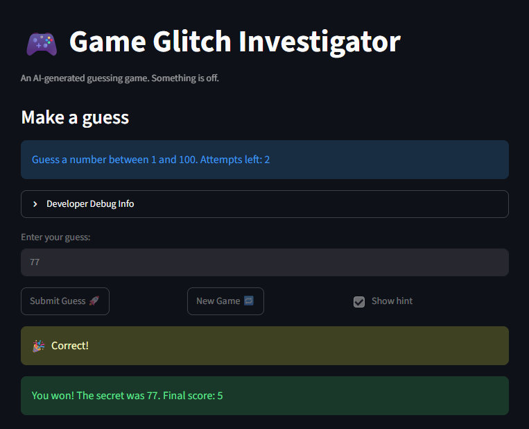

# 🎮 Game Glitch Investigator: The Impossible Guesser

## 🚨 The Situation

You asked an AI to build a simple "Number Guessing Game" using Streamlit.
It wrote the code, ran away, and now the game is unplayable. 

- You can't win.
- The hints lie to you.
- The secret number seems to have commitment issues.

## 🛠️ Setup

1. Install dependencies: `pip install -r requirements.txt`
2. Run the broken app: `python -m streamlit run app.py`

## 🕵️‍♂️ Your Mission

1. **Play the game.** Open the "Developer Debug Info" tab in the app to see the secret number. Try to win.
2. **Find the State Bug.** Why does the secret number change every time you click "Submit"? Ask ChatGPT: *"How do I keep a variable from resetting in Streamlit when I click a button?"*
3. **Fix the Logic.** The hints ("Higher/Lower") are wrong. Fix them.
4. **Refactor & Test.** - Move the logic into `logic_utils.py`.
   - Run `pytest` in your terminal.
   - Keep fixing until all tests pass!

## 📝 Document Your Experience

- [The games purpose is for the user to guess the right random number it is "thinking"] Describe the game's purpose.
- [ I found three bugs. The first bug was that the hints were the opposite of what it should give. Ex. The target number was 50 and if I guessed 1 then it would tell me to go lower and vise versa for a number that was higher. The second bug was that the score was a bit funky, I didn't know how it worked so I asked AI to explain the logic and found it was was weird. The third bug was that I could not replay the game. Ex. I would press restart and my attempts would be resetted but I could not submit a guess] Detail which bugs you found.
- [For the hints, I swapped the hitns sincce it was telling me the opposite of what it needed to do. For the points, instead of having your poitns =+ 5 when your gueuss is too high I had it be =-] Explain what fixes you applied.

## 📸 Demo Walkthrough

Describe your fixed game in numbered steps so a reader can follow along without watching a video:

1. Start the game (Number is 40)
2. User enters a guess of 50
3. Game returns "too low, Go higher"
4. User enters 70
5. Game retruns "too high, go lower"
6. Users score and guess attempts gets updated after each guess
7. Repeat until the user enters a correct guess or there are no more guessses available 

**Screenshot** *(optional)*: <!-- Insert a screenshot of your fixed, winning game here -->

## 🧪 Test Results

```
# Paste your pytest output here, e.g.:
# pytest tests/
# ========================= X passed in 0.XXs =========================
```

## 🚀 Stretch Features

- [ ] [If you choose to complete Challenge 4, describe the Enhanced UI changes here — a screenshot is optional]
